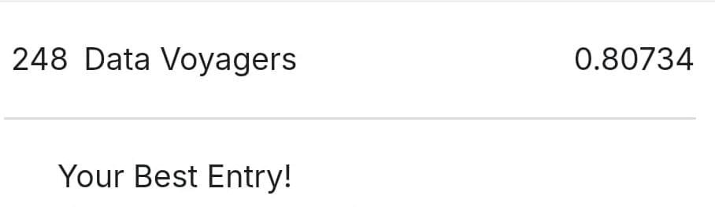

# 🚀 Spaceship Titanic - Machine Learning Competition Project

A comprehensive machine learning project for predicting passenger transportation on the Spaceship Titanic. This project demonstrates end-to-end ML pipeline including data exploration, preprocessing, feature engineering, model selection, and deployment.

## 📊 Project Overview

**Competition**: Spaceship Titanic - Machine Learning Competition  
**Objective**: Predict which passengers were transported to an alternate dimension during the Spaceship Titanic's collision with a spacetime anomaly  
**Best Score**: 80.734% accuracy (Rank 248)  
**Problem Type**: Binary Classification  


*Achievement: 80.734% accuracy - Ranked 248th among all competition participants*

### 🎯 Key Achievements
- **Multiple ML Models**: Implemented Logistic Regression, XGBoost, Random Forest, Deep Learning, and CatBoost
- **Advanced Feature Engineering**: Created 42 engineered features from original dataset
- **Comprehensive EDA**: Detailed exploratory data analysis with visualizations
- **Production Pipeline**: Complete preprocessing and model deployment pipeline
- **Strong Competition Performance**: Ranked 248th among all participants with 80.734% accuracy

## 📁 Project Structure

```
FinalProject/
├── data/
│   ├── Raw/                    # Original competition data
│   │   ├── train.csv          # Training dataset (8693 samples)
│   │   └── test.csv           # Test dataset (4277 samples)
│   └── processed/             # Processed features and splits
│       ├── X_train.csv        # Training features
│       ├── X_val.csv          # Validation features
│       ├── X_test.csv         # Test features
│       ├── y_train.csv        # Training labels
│       ├── y_val.csv          # Validation labels
│       ├── feature_names.csv  # List of 42 engineered features
│       └── test_ids.csv       # Test passenger IDs
├── notebooks/                 # Jupyter notebooks for analysis
│   ├── EDA.ipynb             # Exploratory Data Analysis
│   ├── preprocessing.ipynb    # Data preprocessing pipeline
│   ├── modeling.ipynb         # Model selection and comparison
│   ├── deep_learning.ipynb    # Neural network implementation
│   ├── LogisticRegression.ipynb
│   ├── Final Project Spaceship Titanic_catboost.ipynb
│   ├── Final project Spaceship_XGboost.ipynb
│   ├── projectwithscore80.173rank614.ipynb  # Best performing model
│   └── Submission_last_with score 0.79588.ipynb
├── src/
│   └── model/                 # Saved models and preprocessing objects
│       ├── model.h5          # Trained deep learning model
│       └── scaler.pkl        # Feature scaler object
├── submission/
│   └── submission.csv        # Final competition submission
├── reports/
│   └── figures/              # Generated plots and visualizations
├── environment.yml           # Conda environment configuration
├── data.dvc                  # DVC data version control
├── dvc.yaml                  # DVC pipeline configuration
└── README.md                 # This file
```

## 🔍 Dataset Overview

**Source**: Spaceship Titanic Competition Dataset  
**Training Samples**: 8,693 passengers  
**Test Samples**: 4,277 passengers  
**Features**: 13 original features → 42 engineered features  
**Target**: `Transported` (binary: True/False)  

### Original Features:
- `PassengerId` - Unique passenger identifier
- `HomePlanet` - Planet of departure (Earth, Europa, Mars)
- `CryoSleep` - Suspended animation during voyage
- `Cabin` - Cabin number (Deck/Num/Side format)
- `Destination` - Planet destination
- `Age` - Passenger age
- `VIP` - VIP service status
- `RoomService`, `FoodCourt`, `ShoppingMall`, `Spa`, `VRDeck` - Spending amounts
- `Name` - Passenger name
- `Transported` - Target variable (whether transported to alternate dimension)

## 🛠️ Feature Engineering

Engineered 42 features from original dataset including:

### Cabin-based Features:
- `Deck`: Extracted from cabin (A, B, C, D, E, F, G, T)
- `CabinNum`: Cabin number (numerical)
- `Side`: Cabin side (Port/Starboard)

### Spending-based Features:
- `TotalSpending`: Sum of all spending categories
- `*_Used`: Binary indicators for each spending category
- `AnySpending`: Whether passenger spent any money
- `VIP_SpendingRatio`: Spending behavior analysis for VIP passengers

### Group-based Features:
- `GroupId`: Extracted from PassengerId
- `GroupSize`: Number of passengers in same group
- `IsAlone`: Whether passenger is traveling alone

### Demographic Features:
- `AgeGroup`: Categorized age groups (Child, Teen, Young Adult, Adult, Senior)
- `CryoSleep_Age`: Interaction between CryoSleep and Age

## 🤖 Machine Learning Models

### Models Implemented:
1. **Logistic Regression** - Baseline model for interpretability
2. **XGBoost** - Best performing model (80.734% accuracy)
3. **Random Forest** - Ensemble method for robustness
4. **Deep Learning** - Neural networks with TensorFlow/Keras
5. **CatBoost** - Gradient boosting for categorical features
6. **Support Vector Machine** - For comparison

### Model Performance:
- **Best Model**: XGBoost with extensive feature engineering
- **Best Score**: 80.734% accuracy (Rank 248)
- **Validation Strategy**: Stratified K-Fold Cross-Validation
- **Metrics Used**: Accuracy, Precision, Recall, F1-Score, ROC-AUC

## 📈 Methodology

### 1. Exploratory Data Analysis (EDA)
- Missing value analysis and patterns
- Feature distributions and correlations
- Target variable analysis
- Passenger behavior insights

### 2. Data Preprocessing
- Missing value imputation (median for numerical, mode for categorical)
- Outlier detection and treatment
- Feature scaling and normalization
- Categorical encoding (One-Hot, Label Encoding)

### 3. Feature Engineering
- Domain-specific feature creation
- Interaction terms
- Polynomial features
- Feature selection based on importance

### 4. Model Development
- Multiple algorithm comparison
- Hyperparameter tuning with GridSearchCV
- Cross-validation for robust evaluation
- Ensemble methods

### 5. Model Evaluation
- Performance metrics comparison
- Feature importance analysis
- Model interpretability
- Final model selection

## 🚀 Quick Setup Steps

### 1. Clone Repository
```bash
git clone <repository-url>
cd FinalProject
```

### 2. Setup Environment
```bash
conda env create -f environment.yml
conda activate spaceship
```

### 3. Pull Data (if using DVC)
```bash
dvc pull
```

### 4. Run Notebooks
Open Jupyter and run notebooks in this order:
1. `EDA.ipynb` - Understand the data
2. `preprocessing.ipynb` - Prepare features  
3. `modeling.ipynb` - Compare models
4. Best performing models for final predictions

## 📊 Key Insights

### Data Insights:
- **Missing Values**: Significant missing data in Cabin (~2.4%), Age (~2.7%)
- **Class Balance**: Relatively balanced target (50.4% transported)
- **Spending Patterns**: Strong correlation between CryoSleep and zero spending
- **Group Behavior**: Passengers in same group often have similar outcomes

### Feature Insights:
- **Most Important Features**: CryoSleep, Age, VIP status, Deck location
- **Spending Impact**: Total spending amount is highly predictive
- **Group Effects**: Group size and traveling alone significantly impact transportation
- **Cabin Location**: Deck and side of ship influence transportation probability

## 🛠️ Technologies Used

### Core Libraries:
- **Python 3.10** - Programming language
- **Pandas** - Data manipulation and analysis
- **NumPy** - Numerical computing
- **Scikit-learn** - Machine learning algorithms
- **XGBoost** - Gradient boosting framework
- **TensorFlow/Keras** - Deep learning
- **CatBoost** - Gradient boosting for categorical features

### Visualization:
- **Matplotlib** - Basic plotting
- **Seaborn** - Statistical visualizations
- **Plotly** - Interactive visualizations

### Development Tools:
- **Jupyter Notebooks** - Interactive development
- **DVC** - Data version control
- **Git** - Source code management
- **Conda** - Environment management

## 📋 Working with Data

### Pull Latest Data
```bash
dvc pull
```

### Push New Data
```bash
# Add your data file
dvc add data

# Commit to git
git add data/your-file.csv.dvc .gitignore
git commit -m "Add new data"

# Push data to storage
dvc push

# Push code changes
git push
```

### Push Code Changes
```bash
git add .
git commit -m "your message"
git push
```

## 🏆 Results Summary

- **Final Accuracy**: 80.734%
- **Competition Rank**: 248 out of all participants
- **Best Model**: XGBoost with feature engineering
- **Cross-Validation Score**: Consistent performance across folds
- **Feature Count**: 42 engineered features from 13 original

## 🔄 Future Improvements

1. **Advanced Feature Engineering**: More complex feature interactions
2. **Ensemble Methods**: Combine multiple models for better performance
3. **Deep Learning**: More sophisticated neural network architectures
4. **Hyperparameter Optimization**: Automated hyperparameter tuning
5. **Feature Selection**: Advanced feature selection techniques

## 👨‍💻 Author

NTI Summer Training Internship Project  
Machine Learning Competition Implementation

---

*This project demonstrates a complete machine learning pipeline from data exploration to model deployment, achieving rank 248 with 80.734% accuracy in the Spaceship Titanic classification challenge.*